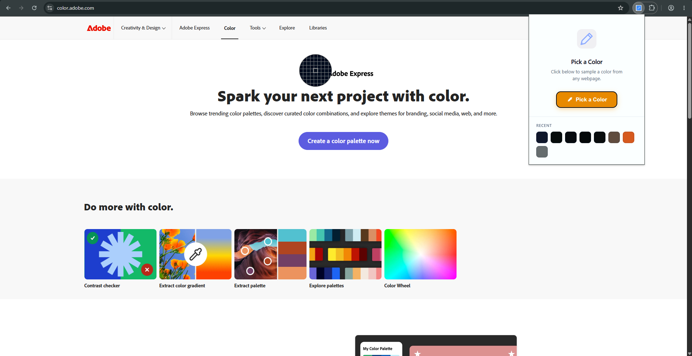
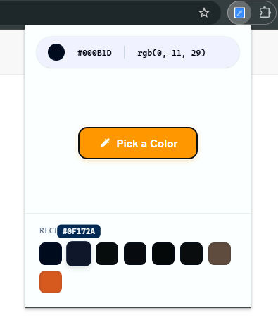

# ColorGrax 🎨
 
A minimal, fast Chrome extension for picking colors from any webpage. Sample any pixel on screen and instantly get its HEX and RGB values — clean UI, zero clutter.
 
## Features
 
- 🎯 **Pick any color** from any webpage using your browser's native eyedropper
- 📋 **One-click copy** — click HEX or RGB to copy instantly to clipboard
- 🕘 **Color history** — quick access to your last picked colors
- ✨ **Minimal, friendly UI** — no bloat, no distractions
- ⚡ **Lightweight** — built with vanilla HTML/CSS/JS, no frameworks
## Screenshot
 
<!-- Add a screenshot or GIF of the extension here -->

        
 
## Installation
 
### From Chrome Web Store
*(Coming soon)*
 
### Manual / Developer Install
 
1. Clone this repository
```bash
   git clone https://github.com/your-username/colorgrax.git
```
2. Open Chrome and go to `chrome://extensions`
3. Enable **Developer mode** (top right toggle)
4. Click **Load unpacked** and select the `colorgrax` folder
5. Pin the ColorGrax icon to your toolbar and you're ready to go
## Usage
 
1. Click the ColorGrax icon in your Chrome toolbar
2. Click **Pick a Color**
3. Click anywhere on your screen to sample that color
4. The HEX and RGB values appear in the top bar — click either to copy
## Browser Compatibility
 
ColorGrax relies on the native [`EyeDropper` API](https://developer.mozilla.org/en-US/docs/Web/API/EyeDropper), supported in:
 
- Chrome 95+
- Edge 95+
- Other Chromium-based browsers with EyeDropper support
Firefox and Safari are not currently supported.
 
## Tech Stack
 
- Manifest V3
- Vanilla JavaScript, HTML, CSS
- `chrome.storage.local` for color history
- Native `EyeDropper` API for color sampling
## Project Structure
 
```
colorgrax/
├── manifest.json
├── popup.html
├── popup.css
├── popup.js
├── icons/
│   ├── icon16.png
│   ├── icon48.png
│   └── icon128.png
└── README.md
```
 
## Contributing
 
Contributions, issues, and feature requests are welcome. Feel free to check the [issues page](https://github.com/your-username/colorgrax/issues) or open a pull request.
 
## License
 
[MIT](LICENSE)
 
---
 
Made with 🎨 by Shakib Hasan
 